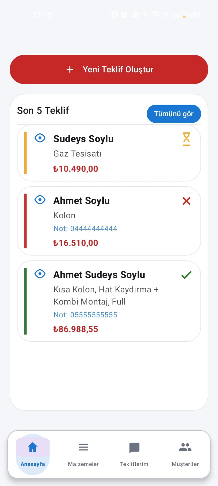
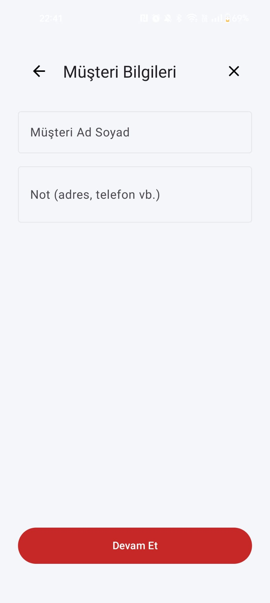
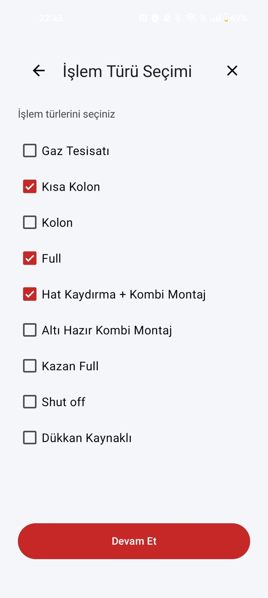
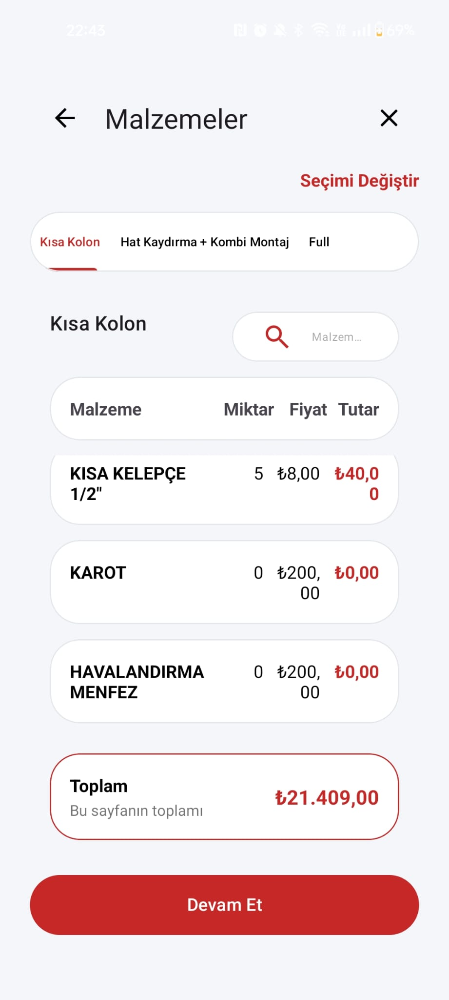
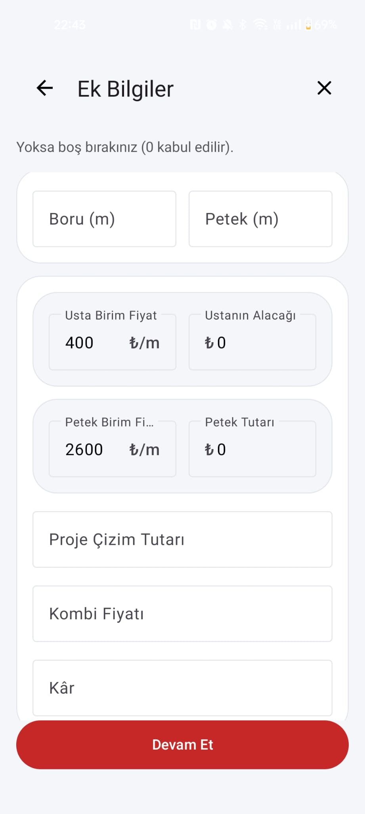
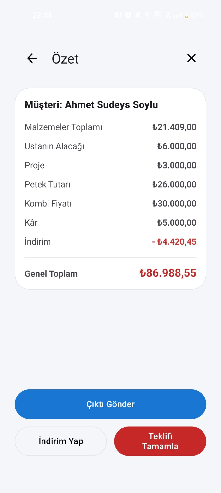
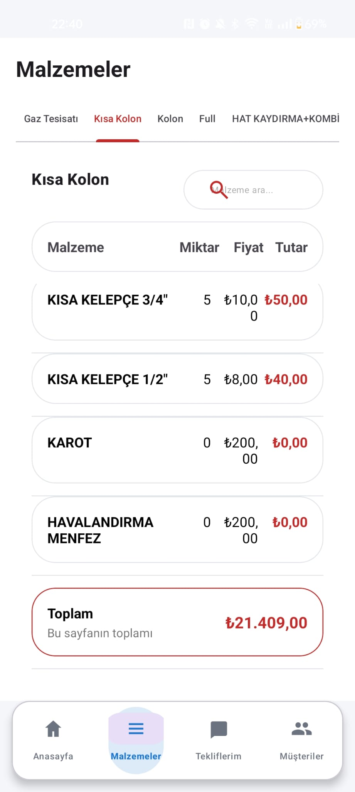
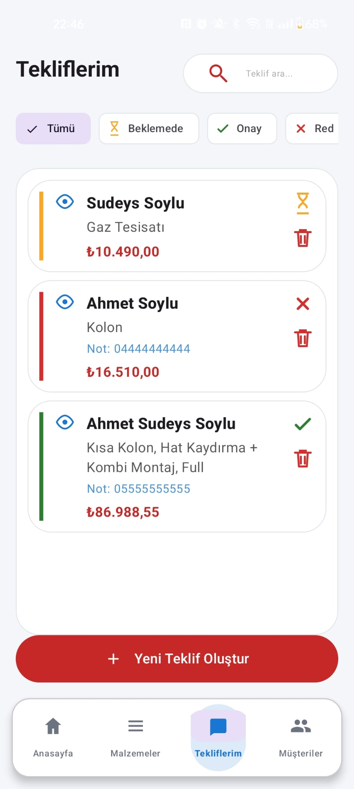
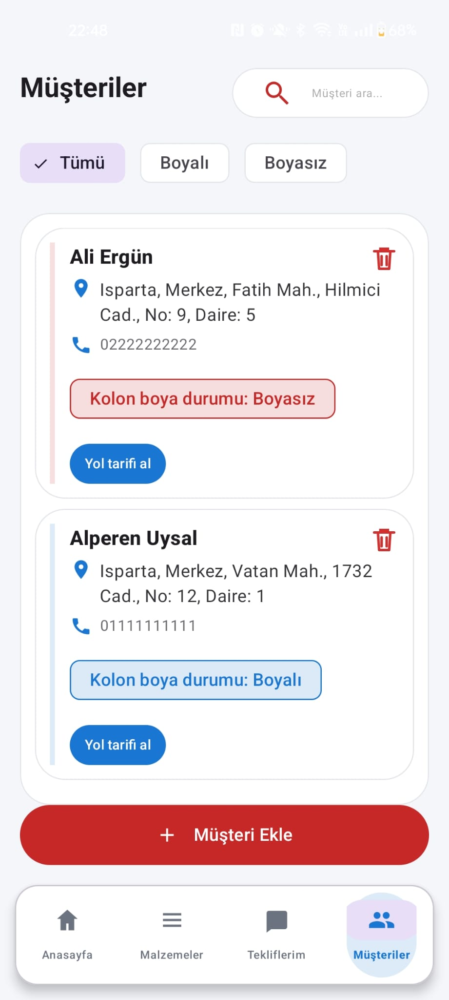

# 🚀 DOĞALGAZ TEKLİF FİYATLANDIRMA (Yeni adıyla yakında YAYINDA!)

## Doğalgaz Saha ve Teklif Yönetimi Sistemi

**Doğalgaz Usta**, doğalgaz mühendislik firmalarının saha süreçlerini hızlandırmak, standartlaştırmak ve hatasız hale getirmek için geliştirilmiş profesyonel bir **Android uygulamasıdır**.
Sahada yapılan karmaşık hesaplamaları saniyelere indirir, teklif oluşturma sürecini tek akışta toplar ve tüm operasyonu dijital bir yapıya taşır.

---

## 📸 Uygulama İçi Görseller

Aşağıda uygulamanın temel ekranlarına ait görseller yer almaktadır.
Bu bölümde uygulamanın kullanım yapısı, ekran akışları ve temel fonksiyonları net şekilde görülebilir.

### Giriş ve Karşılama

  
  

### Anasayfa

  

### Teklif Oluşturma Akışı

  
  
  
  
  

### Malzemeler

  

### Tekliflerim

  

### Müşteriler

  

---

## 🎯 Neden Doğalgaz Usta!

Saha ekipleri çoğu zaman müşteriye anında fiyat vermek zorunda kalır. Kağıt, defter, hesap makinesi veya ezbere dayalı fiyatlandırmalar hem zaman kaybettirir hem de ciddi hatalara yol açar.
**Doğalgaz Usta**, bu süreci sadeleştirerek mühendislik disiplinine uygun, tutarlı ve güvenilir teklifler oluşturmanızı sağlar. Aynı zamanda tüm müşteri ve teklif kayıtlarını merkezi bir yapıda saklayarak güçlü bir kurumsal hafıza oluşturur.

---

## 🏗️ Kurumsal Kimliğiniz Sahada

Uygulama ilk kurulumda firma adı ve logo yüklenerek kullanıma hazır hale gelir.
Oluşturulan tüm teklifler bu bilgilerle otomatik olarak hazırlanır. Müşteriye sunulan her belge, firmanızın kurumsal duruşunu net ve tutarlı şekilde yansıtır.

---

## 🧭 Uygulama Yapısı

Doğalgaz Usta, sahada hızlı ve pratik kullanım gözetilerek tasarlanmış **4 temel sayfadan** oluşur. Her sayfa, sürecin belirli bir ihtiyacını karşılayacak şekilde sade ve odaklıdır.

---

### 🏠 Anasayfa – Teklifin Başladığı Yer

Anasayfa, tüm sürecin merkezidir.
**“Yeni Teklif Oluştur”** butonu ile teklif akışı tek dokunuşla başlatılır. Aynı ekranda son 5 teklif görüntülenebilir, **“Tümünü Gör”** ile teklif arşivine geçilebilir.

Teklif oluşturma sırasında önce işlem türü seçilir. Bu seçime göre, **Malzemeler** adımında o işe uygun malzemeler otomatik olarak hazır gelir. Eve veya işe özel bir durum varsa, malzemeye dokunarak miktar ve fiyat anında düzenlenebilir.

Akışın sonunda özet ekranında malzeme, işçilik ve diğer kalemlerin toplamları net şekilde görüntülenir.
İstenirse indirim uygulanır ve **tek tıkla profesyonel PDF teklif** oluşturulur. Teklif, WhatsApp dahil istenilen platformdan anında müşteriye paylaşılabilir. Tamamlanan her teklif otomatik olarak arşive kaydedilir.

---

### 🧰 Malzemeler – Güncel Fiyat, Doğru Hesap

Bu sayfa fiyatlandırmanın temelini oluşturur.
Her iş türüne ait malzemeler düzenli şekilde listelenir. Fiyat değişiklikleri buradan güncellenir ve yapılan güncellemeler sonraki tüm tekliflere otomatik olarak yansır. Böylece sahada her zaman **güncel ve tutarlı** fiyatlar kullanılır.

---

### 📄 Tekliflerim – Süreç Takibi ve Kontrol

Oluşturulan tüm teklifler bu bölümde listelenir.
Tekliflerin durumu **bekliyor**, **onaylandı** veya **reddedildi** olarak değiştirilebilir. Filtreleme sayesinde yalnızca istenilen durumdaki teklifler saniyeler içinde görüntülenir. Bu yapı, saha ve ofis arasındaki iş takibini netleştirir.

---

### 👥 Müşteriler – Kayıt, Konum ve Boya Takibi

Bu sayfada çalışılan tüm müşterilerin telefon, adres ve diğer bilgileri saklanır.
Doğalgaz tesisatlarında zorunlu olan **boru boya işlemleri** için özel takip alanı bulunur. Hangi boruların boyandığı veya boyanması gerektiği düzenli şekilde izlenebilir.

**“Şu anki konumu kullan”** özelliği sayesinde adres bilgileri GPS üzerinden otomatik doldurulur ve müşteri kaydı saniyeler içinde tamamlanır.

---

## 📊 Teklif ve İş Süreçlerinde Netlik

Tüm teklifler merkezi bir arşivde tutulur.
Geçmiş teklifler görüntülenebilir, düzenlenebilir ve iş durumlarına göre takip edilebilir. Bu yapı operasyonel şeffaflık sağlar ve sürecin her aşamasını kontrol altında tutmanıza imkan verir.

---

## 📱 Kısaca Doğalgaz Usta!

* Sahada saniyeler içinde net teklif
* İş türüne göre otomatik malzeme ve fiyat yapısı
* Kurumsal kimlikli PDF teklif çıktıları
* Müşteri, teklif ve boya kayıtlarının tek merkezden yönetimi
* Sade, hızlı ve profesyonel kullanım

**Doğalgaz Usta**, firma adınızı ve logonuzu yükleyerek hemen kullanmaya başlayabileceğiniz; sahada hız, ofiste kontrol sağlayan güçlü bir doğalgaz saha yönetim çözümüdür.

---

