<!-- ======================= HERO/BAŞLIK ======================= -->

# 🔥 Doğalgaz Teklif Fiyatlandırma

<!-- Animasyonlu Alt Başlık -->

  Sahada yapılan karmaşık hesaplamaları saniyelere indirin, kurumsal teklifinizi tek akışta oluşturun ve tüm operasyonunuzu tamamen dijitalleştirin.

 

<!-- ======================= MAĞAZA ROZETLERİ (Hizalanmış & Dengeli) ======================= -->

  
  

### 👉 **Uygulamayı Hemen İndirin ve Kullanmaya Başlayın** 👈

 

<!-- ======================= TEKNOLOJİ ROZETLERİ ======================= -->

 

<!-- ======================= EKRAN GÖRÜNTÜLERİ ======================= -->
<h2 align="center">📱 Ekran Görüntüleri</h2>

<!-- 1. Satır: Temel Ekranlar (4'lü) -->

  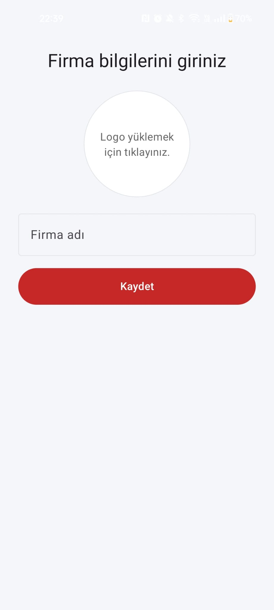
  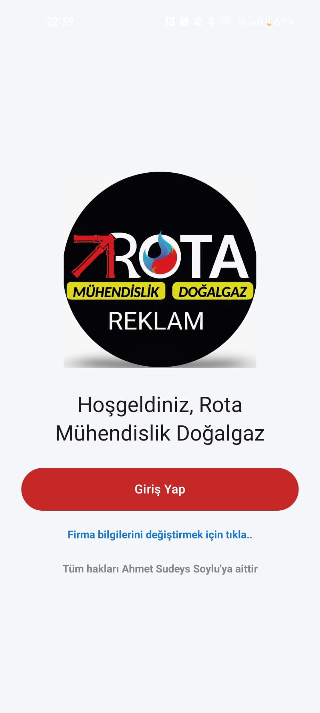
  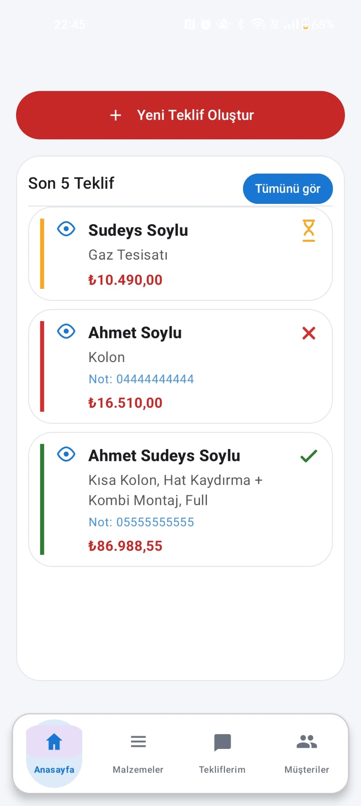
  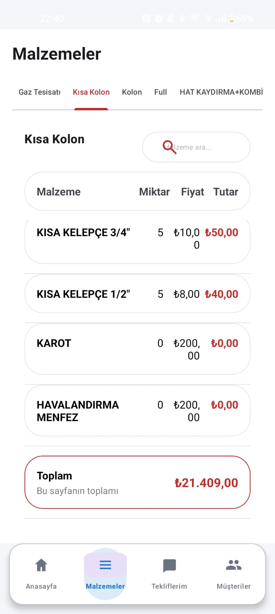

<!-- 2. Satır: Teklif Akışı (4'lü) -->

  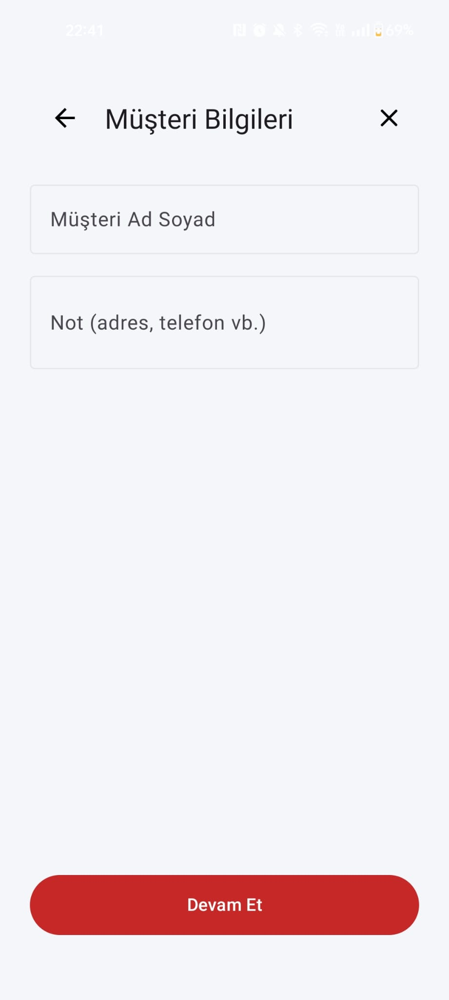
  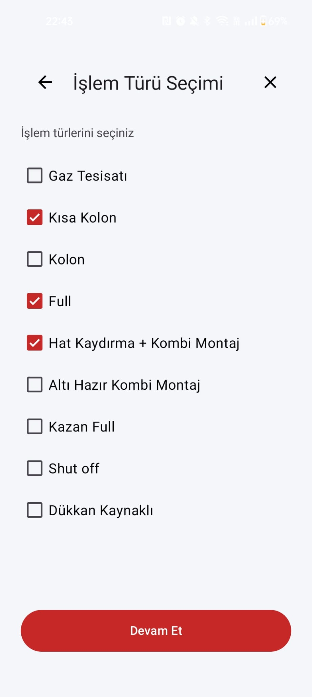
  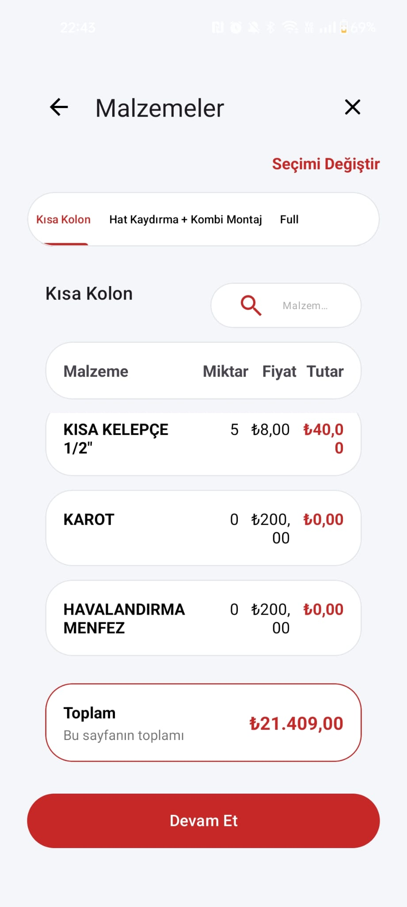
  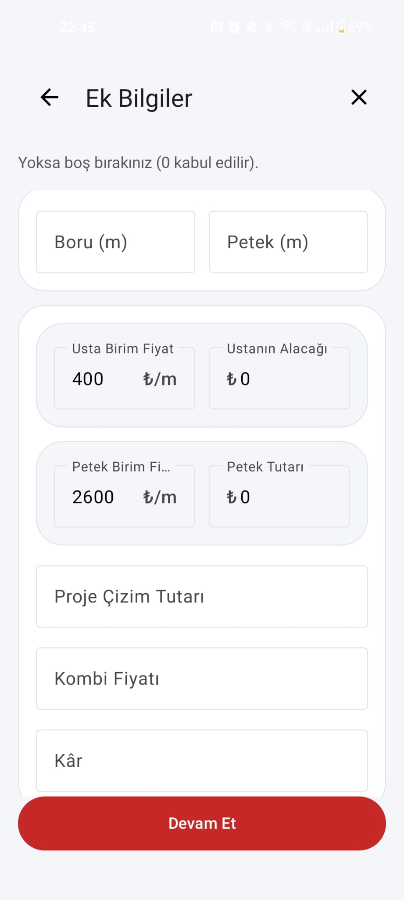

<!-- 3. Satır: Sonuç, Yönetim ve Yeni Görsel (4'lü) -->

  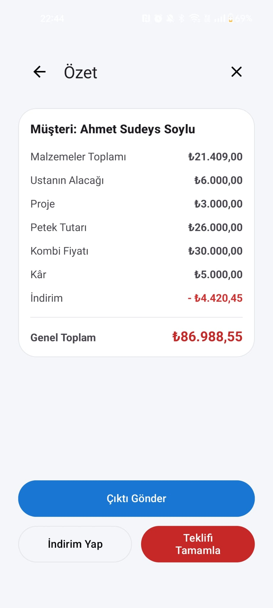
  
  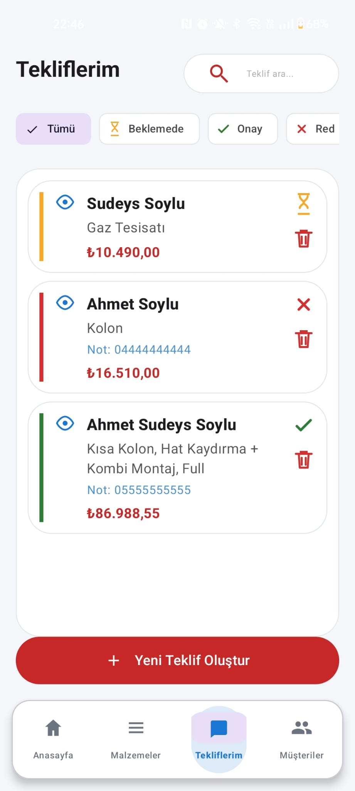
  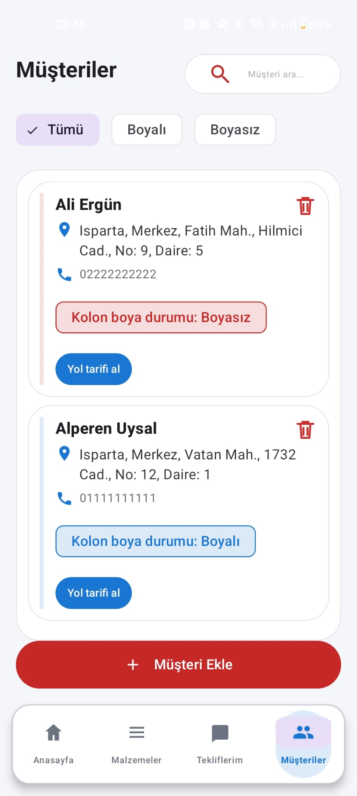

 

<!-- ======================= TANITIM VİDEOSU ======================= -->
<h2 align="center">🎬 Uygulama Tanıtım Videosu</h2>

  
https://github.com/user-attachments/assets/d89d013a-c07e-4f4b-8fb0-a46bf85d1f3a

 

---

## ✨ Kağıt Kalemle Fiyatlandırma Devrini Kapatın

Saha ekipleri çoğu zaman müşteriye anında fiyat vermek zorunda kalır. Kağıt, defter, hesap makinesi veya ezbere dayalı fiyatlandırmalar hem zaman kaybettirir hem de ciddi maddi hatalara yol açar. 

**Doğalgaz Teklif Fiyatlandırma**, bu süreci sadeleştirerek mühendislik disiplinine uygun, tutarlı ve güvenilir teklifler oluşturmanızı sağlar. Firma adınızı ve logonuzu sisteme bir kez yükleyin; oluşturduğunuz tüm teklifler saniyeler içinde **kurumsal bir PDF belgesi** olarak müşterinizin WhatsApp'ında olsun.

 

## 🧠 Temel Felsefe — Hız, Kurumsallık, Kontrol

> Sahada müşteriyi bekletmeden verilen **doğru ve kurumsal** bir teklif, işi alma ihtimalini %80 artırır.

Uygulama bu saha gerçeğini üç aşamalı bir mimari ile çözer:

|   | Aşama | Ne yapar? |
| :---: | :--- | :--- |
| ⚡ | **Hız** | İş türünü seçtiğiniz an gerekli tüm malzemeler otomatik listelenir. Sadece farklılıkları düzenler, saniyeler içinde fiyatı çıkarırsınız. |
| 🏢 | **Kurumsallık** | Hesaplanan fiyatı kağıda yazmak yerine, logonuzun ve firma bilgilerinizin olduğu profesyonel bir PDF'e dönüştürür. |
| 📊 | **Kontrol** | Geçmiş teklifler (Onaylandı/Reddedildi), müşteri GPS konumları ve boru boya işlemleri tek merkezden takip edilir. |

 

## 🚀 Öne Çıkan Özellikler

- **📄 Kurumsal PDF Çıktıları** — Müşteriye sunulan her belge firmanızın profesyonel duruşunu net ve tutarlı şekilde yansıtır.
- **🧰 Otomatik Malzeme Yapısı** — Yapılacak işin türüne (Kombi montajı, tesisat çekimi vb.) göre güncel malzemeler ve fiyatlar anında ekrana gelir.
- **📍 GPS Destekli Müşteri Kaydı** — "Şu anki konumu kullan" özelliği sayesinde müşteri adres bilgileri GPS üzerinden otomatik doldurulur.
- **🎨 Boya ve Süreç Takibi** — Doğalgaz tesisatlarında zorunlu olan *boru boya* işlemleri için özel takip alanı bulunur.
- **📴 Çevrimdışı/Merkezi Arşiv** — Tamamlanan tüm teklifler otomatik arşive kaydedilir, internet olmasa bile geçmiş fiyatlandırmalara ulaşılır.

 

## 🧭 Uygulama Yapısı & Akışlar

Uygulama, sahada hızlı kullanım gözetilerek tasarlanmış **4 temel sayfadan** oluşur:

### 🏠 Anasayfa – Teklifin Başladığı Yer
Tüm sürecin merkezidir. **“Yeni Teklif Oluştur”** butonu ile akış tek dokunuşla başlatılır. İşlem türü seçilir, malzemeler otomatik gelir. İstenirse indirim uygulanıp tek tıkla müşteriye WhatsApp üzerinden teklif atılabilir. Son 5 teklif anasayfada anlık görüntülenir.

### 🧰 Malzemeler – Güncel Fiyat, Doğru Hesap
Fiyatlandırmanın temeli buradadır. Malzeme fiyatlarında yaşanan değişiklikler buradan güncellenir ve sonraki tüm tekliflere otomatik yansır. Sahada her zaman **en güncel maliyetlerle** teklif verilir.

### 📄 Tekliflerim – Süreç Takibi
İş takibini netleştirir. Oluşturulan teklifler **Bekliyor, Onaylandı, Reddedildi** durumlarına göre saniyeler içinde filtrelenir. Saha ve ofis arasındaki kopukluğu tamamen ortadan kaldırır.

### 👥 Müşteriler – Rehber ve Operasyon
Çalışılan müşterilerin iletişim bilgileri, otomatik GPS konumları ve operasyonel verileri (zorunlu boru boya işlemleri vb.) burada düzenli şekilde tutulur.

 

## 🏗️ Teknik Altyapı ve Mimari

Uygulama, veri güvenliği ve hızlı saha operasyonları için modern Android teknolojileri ile inşa edilmiştir:

| Bileşen | Teknoloji & Kütüphane |
| :--- | :--- |
| **Geliştirme Dili** | Kotlin |
| **Arayüz (UI)** | XML / Native View System |
| **Veritabanı** | Room (SQLite) *(Hızlı ve Yerel Veri Saklama)* |
| **Belge Üretimi** | Native PDF Generation API |
| **Konum Servisleri** | Google Location Services *(Otomatik Adres Tespiti)* |
| **Mimari Yaklaşım** | MVC / MVVM Standartları |

 

---

### Sahada **Hız**, Ofiste **Kontrol** Sağlayın.

  
  

© 2026 Doğalgaz Teklif Fiyatlandırma Sistemi · ❤️ ile geliştirildi.

